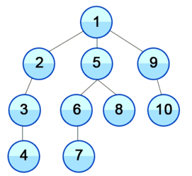

DFS - 그래프의 최대 깊이만큼의 공간을 요구. 공간을 적게 씀. 그러나 최단경로를 찾기는 힘들다.

BFS - 최단경로 찾기 용이함. 모든 분기된 수를 다 비교하면서 저장하다 보니 공간을 많이 씀. 시간이 오래 걸린다.


##DFS (Depth First Search)

갈 수 있는 만큼 계속해서 탐색하다가 갈 수 없게 되면 다른 방향으로 다시 탐색하는 구조입니다.

- 노드를 방문하고 깊이 우선으로 인접한 노드를 방문한다.
- 또 그 노드를 방문해서 깊이 우선으로 인접한 노드를 방문한다.
- 만약 끝에 도달했다면 리턴한다. (재귀)



DFS 의 반복 방식은 방문하지 않은 원소를 계속해서 찾아가면 됨.

즉,
DFS(node) = node + DFS(node와 인접하지만 방문하지 않은 다른 node)
로 반복하면 된다.

방문하지 않았다는 조건은 다 기록해놔야 알 수 있다.
이를 위해서 visited 라는 배열에 방문한 노드를 기록해두면 수월하다 !

### -재귀적 풀이-
1. 루트 노드부터 시작한다.
2. 현재 방문한 노드를 visited 에 추가한다.
3. 현재 방문한 노드와 인접한 노드 중 방문하지 않은 노드에 방문한다.
4. 2부터 반복한다.

<br> -> [1, 2, 3, 4, 5, 6, 7, 8, 9, 10]

### -스택 풀이-
DFS 는 탐색하는 원소를 최대한 깊게 따라가야 함
이걸 다시 말하면 인접한 노드 중 방문하지 않은 모든 노드들을 저장해두고,
가장 마지막에 넣은 노드들만 꺼내서 탐색하면 된다. <br>

가장 마지막에 넣은 노드들..? → 스택을 이용하면 DFS 를 재귀 없이 구현할 수 있음!

1. 루트 노드를 스택에 넣는다
2. 현재 스택의 노드를 빼서 visited 에 추가한다.
3. 현재 방문한 노드와 인접한 노드 중 방문하지 않은 노드를 스택에 추가한다.
4. 2부터 반복한다.
5. 스택이 비면 탐색을 종료한다.

<br>-> [1, 9, 10, 5, 8, 6, 7, 2, 3, 4]

**스택을 사용하니까 가장 뒤에 있는 원소가 빠진다. 재귀적 풀이와 방문 순서가 다름!!**
<br> 
```python
#### 이해를 돕기위한 재귀적 DFS 순서 ####

graph = {
    1: [2, 5, 9],
    2: [1, 3],
    3: [2, 4],
    4: [3],
    5: [1, 6, 8],
    6: [5, 7],
    7: [6],
    8: [5],
    9: [1, 10],
    10: [9]
}
visited = [] # 방문한 걸 저장하기 위한 배열

1. 우선 탐색 시작 노드를 1로 잡겠습니다!

2. 현재 방문한 노드인 1을 visited 에 추가합니다. # visited -> [1]

3. 인접한 노드들인 [2, 5, 9] 에서 방문하지 않은 것들은 [2, 5, 9] 입니다. 2 에 방문합니다.

4. 현재 방문한 노드인 2을 visited 에 추가합니다. # visited -> [1, 2]

5. 인접한 노드들인 [1, 3] 에서 방문하지 않은 것들은 [3] 입니다. 3에 방문합니다.

6. 현재 방문한 노드인 3을 visited 에 추가합니다. # visited -> [1, 2, 3]

7. 인접한 노드들인 [2, 4] 에서 방문하지 않은 것들은 [4] 입니다. 4에 방문합니다.

8. 현재 방문한 노드인 4을 visited 에 추가합니다. # visited -> [1, 2, 3, 4]

9. 인접한 노드들인 [3] 에서 방문하지 않은 것들이 없습니다. 7로 돌아갑니다.

7. 인접한 노드들인 [2, 4] 에서 방문하지 않은 것들이 없습니다. 5로 돌아갑니다.

5. 인접한 노드들인 [1, 3] 에서 방문하지 않은 것들이 없습니다. 3로 돌아갑니다.

3. 인접한 노드들인 [2, 5, 9] 에서 방문하지 않은 것들은 [5, 9] 입니다. 5에 방문합니다.

10. 현재 방문한 노드인 5를 visited 에 추가합니다.  # visited -> [1, 2, 3, 4, 5]

11. 인접한 노드들인 [1, 6, 8] 에서 방문하지 않은 것들은 [6, 8] 입니다. 6에 방문합니다.

12. 현재 방문한 노드인 6를 visited 에 추가합니다.  # visited -> [1, 2, 3, 4, 5, 6]

13. 인접한 노드들인 [5, 7] 에서 방문하지 않은 것들은 [7] 입니다. 7에 방문합니다.

14. 현재 방문한 노드인 7를 visited 에 추가합니다.  # visited -> [1, 2, 3, 4, 5, 6, 7]

15. 인접한 노드들인 [6] 에서 방문하지 않은 것들이 없습니다. 11로 돌아갑니다.

11. 인접한 노드들인 [1, 6, 8] 에서 방문하지 않은 것들은 [8] 입니다. 8에 방문합니다.

16. 현재 방문한 노드인 8을 visited 에 추가합니다.  # visited -> [1, 2, 3, 4, 5, 6, 7, 8]

17. 인접한 노드들인 [5] 에서 방문하지 않은 것들이 없습니다. 11로 돌아갑니다.

11. 인접한 노드들인 [1, 6, 8] 에서 방문하지 않은 것들이 없습니다. 3으로 돌아갑니다.

3. 인접한 노드들인 [2, 5, 9] 에서 방문하지 않은 것들은 [9] 입니다. 9에 방문합니다.

18. 현재 방문한 노드인 9을 visited 에 추가합니다.  # visited -> [1, 2, 3, 4, 5, 6, 7, 8, 9]

19. 인접한 노드들인 [1, 10] 에서 방문하지 않은 것들은 [10] 입니다. 10에 방문합니다.

20. 현재 방문한 노드인 10을 visited 에 추가합니다.  # visited -> [1, 2, 3, 4, 5, 6, 7, 8, 9, 10]

21. 인접한 노드들인 [9] 에서 방문하지 않은 것들이 없습니다. 19로 돌아갑니다.

19. 인접한 노드들인 [1, 10] 에서 방문하지 않은 것들이 없습니다. 3로 돌아갑니다.

3. 인접한 노드들인 [2, 5, 9] 에서 방문하지 않은 것들이 없습니다. 1로 돌아갑니다.

1. 끝났습니다.

